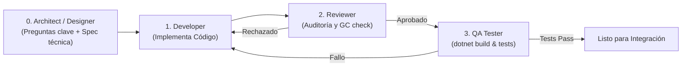

# Reglas y Estándares de Desarrollo: Réplica Retro Arcade (MonoGame)

Este documento establece las directrices de arquitectura, rendimiento, estilo de código y fidelidad retro para el desarrollo del proyecto en **MonoGame (.NET 9)**. Cualquier agente o desarrollador que trabaje en esta base de código debe cumplir estas reglas.

---

## 1. Visión y Fidelidad Retro

1. **Resolución y Escalado Retro (Pixel-Perfect):**
   - El juego debe renderizarse en un `RenderTarget2D` a una resolución interna fija retro (por ejemplo, `256x240` o dimensión adaptada a la pirámide arcade original).
   - El dibujado a la pantalla final debe usar `SamplerState.PointClamp` para evitar filtrado bilineal o desenfoque.
   - El escalado a la resolución de ventana o pantalla completa debe preservar el aspect ratio original mediante barras negras (pillarbox/letterbox) y preferiblemente escalado entero (*integer scaling*).
2. **Framerate y Temporización:**
   - La simulación y renderizado deben operar con tiempo fijo (`IsFixedTimeStep = true`, `TargetElapsedTime = TimeSpan.FromSeconds(1.0 / 60.0)`).
   - Toda la física y movimiento de saltos deben respetar la cadencia exacta de 60 frames por segundo.
3. **Estilo Visual y Paleta:**
   - Paleta de color limitada característica del hardware arcade retro.
   - Las animaciones y sprites deben coincidir con la cuadrícula de píxeles nativa (sin rotaciones suaves ni subpíxeles que rompan la estética retro).

---

## 2. Arquitectura del Código y Organización

Estructura modular bajo el namespace raíz `RetroGamePiramid`:

```
RetroGamePiramid/
├── Content/                   # Texturas, fuentes, efectos de sonido (MGCB)
├── .agents/
│   ├── rules.md               # Reglas y convenciones activas
│   └── skills/                # Directorio para habilidades y procedimientos
└── src/
    ├── Core/                  # Tipos base, constantes globales, GameStateManager
    ├── Entities/              # Jugador (Q*bert), Enemigos (Coily, etc.), Discos de escape
    ├── Grid/                  # Estructura de la pirámide isométrica y nodos de cubos
    ├── Graphics/              # Cámara virtual, RenderTarget, resolución virtual, SpriteBatch helpers
    ├── Input/                 # Mapeo y gestión de controles (diagonales 4-way, gamepad, teclado)
    ├── Audio/                 # Gestor de efectos de sonido y audio chiptune
    ├── Scenes/                # Escenas: TitleScene, GameplayScene, GameOverScene, HighScores
    └── Systems/               # Lógica de colisión en rejilla, IA enemiga, transición de niveles
```

### Principios Arquitectónicos:
- **Separación de Responsabilidades:** Separar estrictamente la lógica de simulación (`Update`) de la presentación (`Draw`). La lógica de entidades y estados no debe depender directamente de `SpriteBatch`.
- **Máquina de Estados:** Las entidades complejas (jugador, enemigos) y el flujo global del juego se rigen por máquinas de estados explícitas (ej: `Idle`, `Jumping`, `Falling`, `Dead`).
- **Sistema de Coordenadas de la Pirámide:**
  - La pirámide se modela como una rejilla discreta basada en filas y columnas `(row, col)` o coordenadas axiales isométricas.
  - Las posiciones en pantalla (`Vector2`) se calculan a partir de la proyección isométrica de la celda `(row, col)` más el desplazamiento parabólico vertical del salto.

---

## 3. Rendimiento y Gestión de Memoria (Zero Allocation en Gameplay)

MonoGame y el recolector de basura (.NET GC) pueden sufrir micro-tirones (*GC pauses*) si se generan objetos temporales en cada frame.

1. **Cero Allocations en `Update()` y `Draw()`:**
   - Prohibido instanciar objetos (`new MyClass()`, `new List<T>()`) en el bucle continuo.
   - Prohibido el uso de LINQ (`.Where()`, `.Select()`, `.ToList()`, etc.) en código de frame rate crítico.
   - Prohibido el boxing/unboxing de structs o enums.
2. **Reutilización y Pooling:**
   - Reutilizar colecciones preasignadas (`Clear()` en lugar de instanciar nuevas colecciones).
   - Implementar pools de objetos si se manejan partículas o entidades temporales.
3. **Uso de Tipos por Valor:**
   - Usar `struct` o `readonly struct` para vectores, datos matemáticos o coordenadas ligeras.

---

## 4. Reglas del Gameplay Isométrico y Pirámide

1. **Movimiento en Cuadrícula (Grid-Locked):**
   - Las entidades se mueven entre nodos adyacentes de la pirámide mediante saltos en 4 diagonales:
     - Arriba-Izquierda (Up-Left)
     - Arriba-Derecha (Up-Right)
     - Abajo-Izquierda (Down-Left)
     - Abajo-Derecha (Down-Right)
2. **Animación de Salto (Hop Interpolation):**
   - Un salto tiene una duración en frames definida (`hopDuration`).
   - La trayectoria sigue una curva parabólica calculada matemáticamente: altura $y = -4 \cdot h \cdot t \cdot (t - 1)$ con $t \in [0, 1]$.
   - El input queda bloqueado durante la ejecución del salto (con un pequeño búfer para registrar la siguiente acción al aterrizar).
3. **Mecánica de Cambio de Color (Cubes):**
   - Cada cubo tiene estados definidos (ej: Color inicial -> Color intermedio -> Color objetivo).
   - La condición de victoria de nivel se comprueba cuando todos los cubos de la pirámide han alcanzado el estado objetivo.
4. **Límites y Muerte por Caída:**
   - Saltar hacia una posición fuera de los límites de la pirámide sin disco volador activa la animación de caída al abismo y pérdida de vida.

---

## 5. Entrada y Controles (Input System)

1. **Soporte Diagonal Intuitivo:**
   - En teclado: soporte para teclado numérico (7, 9, 1, 3), teclas W/A/S/D o combinaciones de flechas.
   - En Gamepad: sticks y D-Pad mapeados a las 4 direcciones diagonales con zona muerta configurable.
2. **Input Buffering:**
   - Registrar la última pulsación válida durante el tramo final de un salto para ejecutarla inmediatamente al aterrizar, ofreciendo la respuesta ágil clásica de arcade.

---

## 6. Audio y Efectos Sonoros

1. **Efectos Chiptune:**
   - Todos los efectos (salto, cambio de color, caída, derrota de enemigo, victoria) se cargan durante `LoadContent()` y se reproducen como `SoundEffectInstance` reutilizables o disparos `Play()` con pitch y volumen controlados.
2. **Evitar Sobrecarga:**
   - Limitar instancias concurrentes del mismo sonido para evitar distorsión o saturación de canales.

---

## 7. Buenas Prácticas de Código en C# / .NET 9

1. **Nomenclatura:**
   - Clases, Interfaces, Métodos y Propiedades: `PascalCase`.
   - Interfaces con prefijo `I` (ej. `IGameEntity`, `IScene`).
   - Campos privados con guion bajo: `_camelCase`.
   - Parámetros y variables locales: `camelCase`.
   - Constantes: `PascalCase` o `UPPER_CASE`.
2. **Manejo de Errores y Compilación:**
   - Tras cada cambio significativo, verificar que el proyecto compila limpiamente con `dotnet build`.
   - No introducir warnings de compilador ni dependencias externas sin justificación.
3. **Comentarios y Documentación:**
   - Comentar la intención matemática y la lógica de la rejilla isométrica.
   - Mantener comentarios claros y concisos.

---

## 8. Equipo de Agentes y Flujo Colaborativo

Para el ciclo de vida del desarrollo se definen cuatro roles especializados:

1. **Technical Architect & Game Designer (`tech_architect` / `@architect`):**
   - Interlocutor principal: toma la visión creativa y plantea preguntas clave de diseño (tiempos de salto, buffering, bordes, estados).
   - Modela la arquitectura de datos, structs, interfaces y máquinas de estados sin sobre-ingeniería.
   - Genera especificaciones atómicas y User Stories técnicas con entradas, salidas, constantes y criterios de aceptación.

2. **Code Developer (`code_developer`):**
   - Responsable de escribir e implementar código C# en MonoGame a partir de las especificaciones del `@architect`.
   - Implementa módulos, entidades, lógica de salto isométrico y renderizado pixel-perfect.
   - Garantiza cero allocations en bucle de juego y verifica la compilación con `dotnet build`.

3. **Code Reviewer (`code_reviewer`):**
   - Audita los cambios de código antes de su integración definitiva.
   - Verifica el cumplimiento estricto de las reglas de rendimiento (detección de `new`, LINQ, boxing en `Update`/`Draw`).
   - Emite veredicto: `APROBADO`, `APROBADO CON SUGERENCIAS` o `RECHAZADO`.

4. **QA Tester (`qa_tester`):**
   - Verifica compilaciones (`dotnet build`) con cero advertencias y errores.
   - Crea y ejecuta pruebas automatizadas unitarias y de integración (`dotnet test`) basadas en los criterios de aceptación del `@architect` para validar la lógica desacoplada (matemáticas de salto, rejilla, cambio de color de cubos, límites, máquinas de estados).

### Flujo de Trabajo Estándar:

